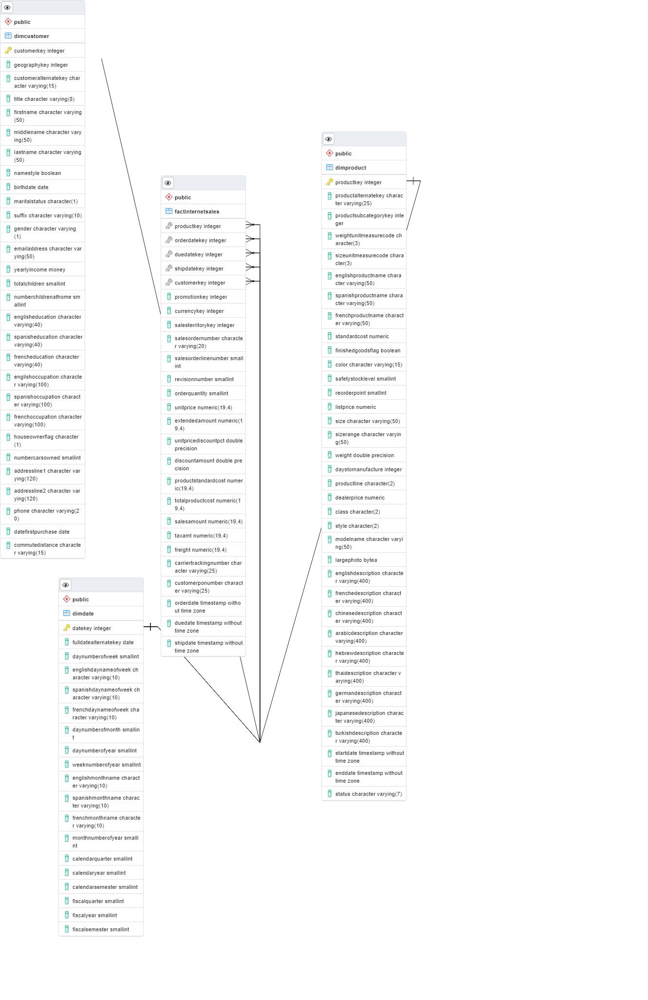

# Simplified Star from AdventureWorksDW

This repo contains **PostgreSQL** scripts to reproduce a simplified star with 4 tables (1 fact and 3 related dimensions) from [Microsoft's AdventureWorksDW](https://github.com/microsoft/sql-server-samples/tree/master) (more information [here](https://learn.microsoft.com/en-us/sql/samples/adventureworks-install-configure?view=sql-server-ver16&tabs=ssms)).

Adventure Works DW (DW for "Data Warehouse") comes in various flavors of Microsoft-related technologies: Transact SQL, SQL Server, and even as Power Bi projects. You can find PostgreSQL dumps out there on GitHub, but I was unable to make them work.

I gave up on trying to restore the whole database, because I just need it for small demonstration purposes. [I got the idea of simplifying the model from this Medium article](https://medium.com/@marinicaionel/dimensional-design-using-adventure-works-dw-a4837fcb9d3b).


I changed the scripts with the help of Chat GPT.


Things I've done:

* Told ChatGPT to translate the Transact SQL to PostgreSQL.
* Replaced money by float, then convert float to money in Postgres.
* Made table and column names lowercase instead of CamelCase (which is PostgreSQL standards).
* I modified the files by hand.
* I created backup SQL files using PgAdmin. I decided to remove the backup dump from the repo because it generates conflicts, the database is small enough to create it from a set of SQL scripts.
* *This is what worked after a lot of pain and trials with other files*.

## Other formats

For now, I created PostgreSQL files. I would like to create the same for SQLite, and maybe some other formats too. The `data` directory has the 4 tables in CSV format with `|` (pipe) separator.

## Installation

First, create a PostcreSQL database, without any tables. Then you can run the scripts to create the tables and to load the data.

The `PostgreSQL` directory contains:

* `create_tables.sql` : run this first to create all the tables.
* `insert_into.sql`: run this to fill the tables.

Another option is to use the `create_tables.sql` file to create the tables and the use the CSV files in the `data` directory to load the tables (separator is a pipe `|`).

## Structure



## Example usage 

You can query the database to answer analytical questions, such as these:

### What products have more sales?

```sql
/* What products make us a higher income? */
SELECT
    modelname,
    englishdescription,
    SUM(extendedamount) AS sales_amount
FROM
    factinternetsales
    JOIN dimproduct ON dimproduct.productkey = factinternetsales.productkey
GROUP BY 
    modelname,
    englishdescription
ORDER BY sales_amount DESC
LIMIT 5
```

------------------------------------------------------------------------------------------------------------------------------------------------------------------------------------------------------------------------------------------
| modelname    | englishdescription                                                                                                                                                                                       | sales_amount |
| ------------ | -------------------------------------------------------------------------------------------------------------------------------------------------------------------------------------------------------- | ------------ |
| Mountain-200 | Serious back-country riding. Perfect for all levels of competition. Uses the same HL Frame as the Mountain-100.                                                                                          | 7929476.45   |
| Road-150     | This bike is ridden by race winners. Developed with the Adventure Works Cycles professional race team, it has a extremely light heat-treated aluminum frame, and steering that allows precision control. | 5549896.77   |
| Road-250     | Alluminum-alloy frame provides a light, stiff ride, whether you are racing in the velodrome or on a demanding club ride on country roads.                                                                | 4451258.23   |
| Touring-1000 | Travel in style and comfort. Designed for maximum comfort and safety. Wide gear range takes on all hills. High-tech aluminum alloy construction provides durability without added weight.                | 2992007.85   |
| Road-350-W   | Cross-train, race, or just socialize on a sleek, aerodynamic bike designed for a woman.  Advanced seat technology provides comfort all day.                                                              | 1580219.71   |
------------------------------------------------------------------------------------------------------------------------------------------------------------------------------------------------------------------------------------------

### What are our sales by shipping Month?

```sql
/* What are our sales by shipping Month */
SELECT 
    englishmonthname,
    SUM(extendedamount) AS sales_amount
FROM
    factinternetsales
    JOIN dimdate ON dimdate.datekey = factinternetsales.shipdatekey
GROUP BY 
    englishmonthname
ORDER BY sales_amount DESC
```

-----------------------------------
| englishmonthname | sales_amount |
| ---------------- | ------------ |
| December         | 3237510.66   |
| November         | 3092692.95   |
| June             | 2848558.44   |
| October          | 2767543.22   |
| August           | 2670946.19   |
| July             | 2512004.52   |
| September        | 2487639.80   |
| May              | 2087135.22   |
| January          | 2070900.08   |
| March            | 1934254.88   |
| April            | 1904794.12   |
| February         | 1744697.81   |
-----------------------------------
